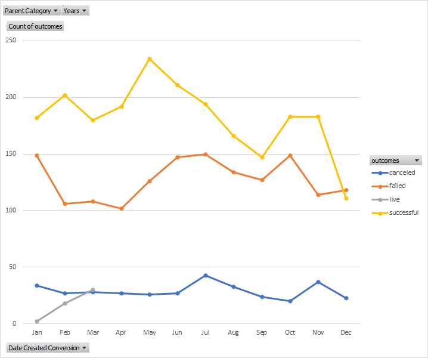

# An Analysis of Kickstarter Campaigns
Use of Filters, PivotTables, and Charts(Including Standard Deviantion, and Interquartile Range)
allow in depth summary of data and visulization of trends

Test img

test img 2

test img 3

